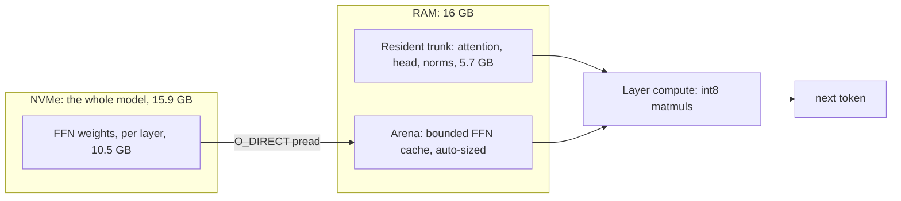
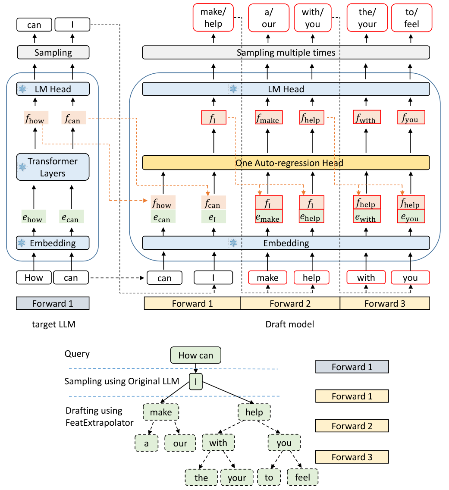
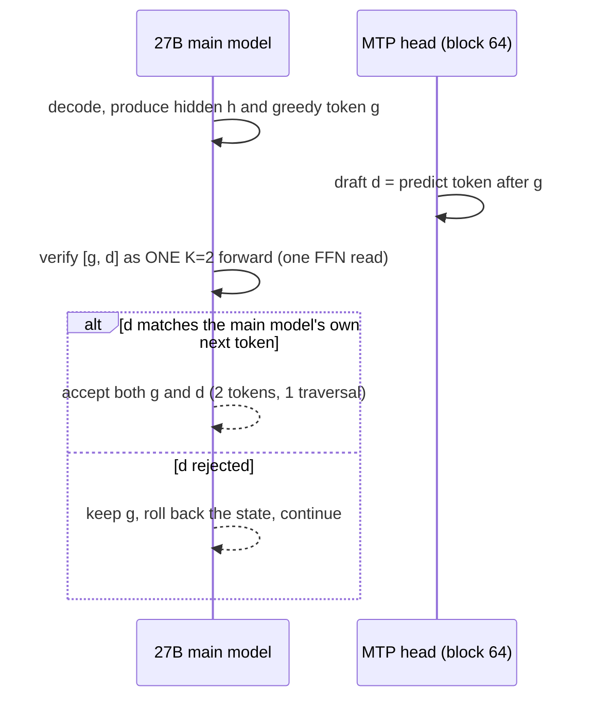
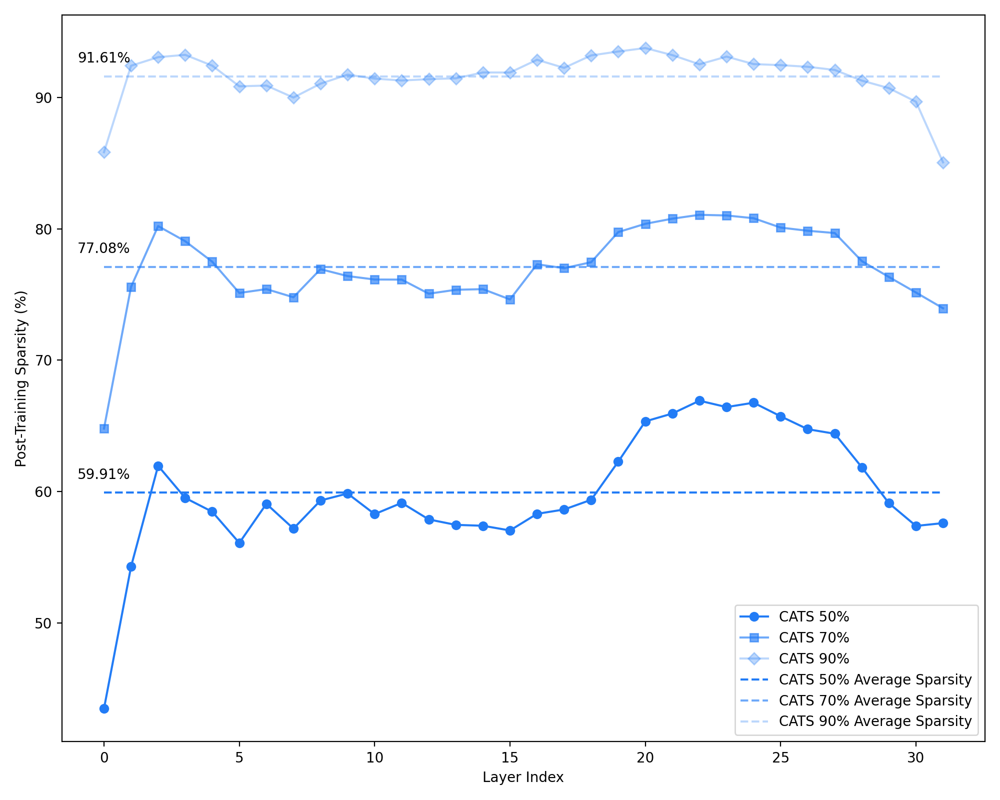
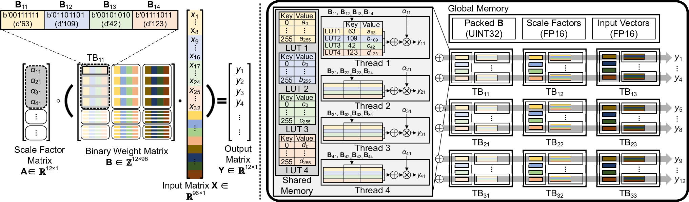

# RustLMHub


-red)

[-blueviolet)](docs/Arron_Leilion_Resume.pdf)
[](mailto:a.leilion@euroswarms.eu)
[](https://github.com/IlumCI)

> Written by **Arron Leilion**. I built this, and I am open to a Researcher or Rust Engineer role in AI/ML. My resume is in this repo: [docs/Arron_Leilion_Resume.pdf](docs/Arron_Leilion_Resume.pdf). Contact: a.leilion@euroswarms.eu, GitHub [@IlumCI](https://github.com/IlumCI), site [euroswarms.eu](https://Euroswarms.eu/). More at the [bottom](#about-the-author).

A from-scratch inference and training engine, written in Rust, that streams model weights off your disk so you can run models that are far larger than your RAM. It runs a dense 27B model on a 16GB laptop by reading the weights straight off an NVMe drive during the forward pass. Every kernel is hand written and verified bit-for-bit against a reference implementation. There is no PyTorch, no llama.cpp, no CUDA requirement, and no external inference runtime linked in. The engine computes everything itself.

## Why this exists

I am greedy. I did the arithmetic on an AI subscription, landed on about $108 a month to rent someone else's GPUs by the token, and decided I would rather point that money at hardware I already own and keep the stack forever. The rule I set myself is simple: if a model fits on my hard drive, I want to run it. Not "load it into RAM." Fit it on the drive. That is the only limit I am willing to accept.

So this is the thing that makes that rule true. It treats the SSD as the top of the memory hierarchy and streams weights through a small resident cache during decode. RAM stops being the wall. The wall becomes disk capacity, which is cheap.

The uncomfortable implication, and I am going to say it out loud: once you can run essentially any open model in existence on hardware you already paid for, bounded only by whether it fits on your drive, the entire business of renting inference by the token starts to look like a tax you volunteered for. A few API resellers and a couple of "we are just a wrapper" startups are not going to enjoy reading this. That is not a bug in the project. That is the point of the project.

And to be clear about scope: this is not only an inference engine. It targets training and research on the same streamed weights. You can fine tune a 27B model on the same 16GB laptop, because the frozen weights stream during the backward pass exactly as they do during the forward pass, and only the small adapter and its optimizer state stay resident.

## Quick start

Pick one.

### Option A: the install script (Linux and macOS)

```sh
./install.sh                 # build release, install to ~/.local/bin
./install.sh --system        # install to /usr/local/bin (uses sudo, also installs the dev tools)
./install.sh --prefix DIR    # install to DIR/bin
./install.sh --no-build      # install already-built binaries only
```

### Option B: make

```sh
make install                 # runs install.sh with the defaults
sudo make install            # system install, tools included
make install-tools           # just the inspection/dev tools
make help                    # every target
```

### Option C: build it yourself

```sh
cd rust
cargo build --release        # produces target/release/rustlm and friends
```

### Then run something

```sh
rustlm pull qwen3.8-27b       # fetch a model into the local registry
rustlm list                   # see what is installed and what can run
rustlm serve qwen3.8-27b      # start an OpenAI-compatible server on 127.0.0.1:11434
rustlm run  qwen3.8-27b       # interactive chat against a running server
rustlm train                  # open the training and evaluation workbench (TUI)
```

The server defaults are tuned for this machine class: int8 fast path on, arena size set to `auto` (the largest cache that fits in free RAM without swapping), a generous context, and a long default generation cap. You do not have to pass flags to get the fast path.

## Table of contents

1. [What this runs on](#1-what-this-runs-on)
2. [The core idea: stream weights, do not load them](#2-the-core-idea-stream-weights-do-not-load-them)
3. [The economics of a streamed decode](#3-the-economics-of-a-streamed-decode)
4. [The arena: which bytes live in RAM](#4-the-arena-which-bytes-live-in-ram)
5. [The int8 activation kernel](#5-the-int8-activation-kernel)
6. [Speculative decoding with the native MTP head](#6-speculative-decoding-with-the-native-mtp-head)
7. [Certified activation sparsity](#7-certified-activation-sparsity)
8. [Table-lookup matmul (LUT-GEMM)](#8-table-lookup-matmul-lut-gemm)
9. [Training and research on streamed weights](#9-training-and-research-on-streamed-weights)
10. [Correctness discipline](#10-correctness-discipline)
11. [Supported models](#11-supported-models)
12. [Command reference](#12-command-reference)
13. [References and inspirations](#13-references-and-inspirations)
14. [License](#14-license)
15. [About the author](#about-the-author)

---

## 1. What this runs on

The reference machine is a laptop. An Intel i7-12650H (6 performance cores, 4 efficiency cores, 16 threads), 16GB of RAM, an RTX 3050 with 4GB of VRAM that the engine deliberately leaves alone, and a Kingston NVMe drive that sustains about 3.1 GB/s of sequential reads.

On that machine, the target model is Qwen3.8-27B at Q4_K_M, which is 15.9GB on disk. That does not fit in 16GB of RAM alongside an operating system, so a normal runtime cannot load it. This engine runs it anyway, because it never tries to load it.

## 2. The core idea: stream weights, do not load them

A transformer decode step reads every weight in the model exactly once to produce one token. Most of those weights are the feed-forward (FFN) matrices, which for this 27B are about 10.5GB of the checkpoint. The attention and embedding and head tensors are much smaller, about 5.7GB, and they get read every step too.

The engine splits the model into two populations:

* Resident weights. Attention projections, the gated delta-net blocks, the output head, and the norms stay in RAM for the whole run. About 5.7GB.
* Streamed weights. The per-layer FFN matrices are read from the SSD during the forward pass, through a small bounded cache called the arena.

Reads go through `O_DIRECT`, which bypasses the operating system page cache. That is deliberate. The engine manages its own cache, and it does not want the kernel evicting a game's textures or a browser's memory to make room for weights it is only going to read once.



The embedding table is not held resident either. It is 715MB, and a decode step needs exactly one row of it, so the engine streams a single row per token straight off the disk. That freed 710MB of RAM, which the arena then uses to cache more FFN layers.

## 3. The economics of a streamed decode

This is the part people get wrong, so I measured it instead of guessing. During decode the CPU sits about 84% idle while the NVMe runs flat out at 3.1 GB/s. The bottleneck is disk bandwidth, and nothing else.

The bytes moved per token obey one equation:

```
bytes_per_token = (total model weights) - (weights currently resident in RAM)
```

Every weight byte is read once per token. The only bytes that do not hit the disk are the ones RAM is already holding. That is why freeing RAM makes decode faster, and why a bigger arena makes decode faster, right up until the whole model is resident.

The profiler (`readprof`) prints the actual per-token, per-layer, per-tensor read map from `/proc/self/io`, and it agrees with the cache accounting to the byte. A representative residency table on this machine:

```
tensor        size      resident?   reads/token
attention     3.60 GB   RESIDENT    0
lm_head       1.04 GB   RESIDENT    0
ssm/deltanet  1.14 GB   RESIDENT    0
embedding     0.72 GB   streamed    ~1 row (~3 KB)
ffn_gate      3.26 GB   STREAMED    ~32 layers
ffn_up        3.26 GB   STREAMED    ~32 layers
ffn_down      4.02 GB   STREAMED    ~32 layers
```

The consequence for optimization is blunt. Faster matmul does nothing for decode, because the CPU is already waiting on the disk. Compression does nothing, because k-quantized weights are already near random entropy (measured: zstd saves 2%). The only levers that move decode are: read fewer bytes (bigger arena, up to the RAM limit), or read more than one token per traversal (speculative decoding, section 6).

## 4. The arena: which bytes live in RAM

The arena is a fixed-size cache of decoded FFN layer slots. The access pattern is a cyclic scan: every token walks layers 0 through N in order, and the working set is larger than the cache. Under that pattern, plain least-recently-used is the worst possible policy, because it evicts exactly the layer the next pass reaches soonest. This is the sequential-flooding problem that database buffer managers solved decades ago.

The engine uses Belady's rule (evict the block used furthest in the future), which on the layer axis is not a prediction at all. At position `l`, the layer `L` cannot be touched again until the scan comes back around, which is `(L - l) mod cycle` steps away. That distance is exact and free to compute, so the optimal eviction is exact.

The arena is sized automatically. On startup, after the resident trunk is loaded, the engine reads `MemAvailable` and gives the arena the largest slice that fits without swapping, leaving a margin for activations, the KV cache, and anything else running (your game, your browser). This does two things at once. It picks the fastest safe cache size with no manual tuning, and it prevents the failure mode where an over-large cache pushes the resident weights into swap on the same disk the model streams from, which does not fail cleanly, it thrashes until the machine is unusable. Pass `--cache-gb auto` (the default) and it re-measures every launch, so a model started while a game is running quietly takes a smaller cache instead of fighting for RAM.

## 5. The int8 activation kernel

Decode is disk-bound, but prefill and training are compute-bound, and there the kernel matters. The engine quantizes activations to int8 (a Q8_K-style block format) once per matmul and keeps the k-quant weight nibbles as integers, so the inner product runs as integer multiply-accumulate. On this CPU that is `maddubs`, which retires 32 int8 products per instruction against 8 float products for the scalar path.

The result is measured at 2.3 to 2.55x on the matmul microbenchmark, about 1.48x on end-to-end decode, and roughly 2.5x on the compute-bound prefill and training paths. The output tokens are identical to the bit-exact float path. Both the Q4_K and Q6_K weight formats have int8 paths, and the AVX2 kernel is proven bit-identical to the scalar reference through an integer accumulation, so batching cannot silently diverge. This is on by default when serving. Set `RUSTLM_INT8=0` or pass `--no-int8` for the bit-exact path.

## 6. Speculative decoding with the native MTP head

This is the one that breaks the disk-bound ceiling. The insight, which I verified by measurement before building anything: a K-wide forward pass reads the FFN weights once, not K times. The engine confirmed it directly, reading a flat 5.6GB whether it processed 1, 2, 4, or 8 candidate positions. One weight traversal can serve several tokens.

The model ships a native multi-token-prediction head (block 64, the next-n head). It is a full transformer block wrapped by a projection that takes the main model's hidden state at position t plus the embedding of the token at t+1, and predicts the token at t+2. That is a drafter. The engine uses it to propose a token, then verifies the proposal with a K=2 forward that costs one FFN traversal for both tokens.



*Figure from EAGLE (Li et al., arXiv:2401.15077). A drafter proposes tokens, and the large model verifies them in one forward pass. Here the drafter is the model's own next-n head, so no separate draft model is needed.*



Verification is greedy-argmax equality, which makes the whole thing lossless: the speculative output is bit-for-bit identical to plain greedy decoding. The `specdec` binary proves this on every run by decoding a prompt both ways and asserting the token sequences match.

The hard part was the rollback. This is a hybrid architecture: most of its non-attention blocks are gated delta-net recurrent state, and a recurrent state cannot be sliced like a KV cache. When a draft is rejected, the engine restores the recurrent state from a checkpoint it took mid-forward (right after the accepted token), and truncates the attention KV. A rejection costs a memory copy, not a re-read of the model.

Measured on the 27B, both runs verified bit-identical to greedy:

| prompt | acceptance | baseline | speculative | speedup |
| --- | --- | --- | --- | --- |
| factual continuation | 100% | 2.95 s/tok | 2.30 s/tok | 1.28x |
| open-ended generation | 60% | 3.11 s/tok | 2.54 s/tok | 1.23x |

The current ceiling is the K=2 verify's serial compute. The compute that grows with K is exactly what can hide behind the flat disk read, and overlapping the two, plus chaining the draft head for wider proposals, is the path toward roughly 2x. Note that this economics is specific to dense models. On a mixture-of-experts model the drafted tokens route to more experts, so the I/O grows with K, and the trick does not pay.

## 7. Certified activation sparsity

A SwiGLU feed-forward has no hard zeros, so skipping any neuron is lossy in general. This engine skips them anyway, but only when it can prove the skip cannot change the emitted token.

For neuron `i`, its exact contribution to the output is `a_i * down[:,i]`, so skipping a set S perturbs the output by at most the sum over S of `|a_i| * ||down[:,i]||`. Propagate that bound to the logits, and if it stays under half the gap between the top-1 and top-2 logits, no logit can overtake the leader, so the greedy token is provably unchanged. The skip is then token-exact, not approximate. On the real 27B this skips up to 27.6% of FFN neurons with byte-identical output.



*Figure from CATS (Lee et al., arXiv:2404.08763). A large fraction of feed-forward neurons contribute negligibly per token, which is what the certified skip exploits. This engine only skips the ones it can prove are safe.* The soundness of the bound is asserted in tests, never assumed, because a wrong mask still produces fluent text and that is the one failure mode this project refuses to allow.

## 8. Table-lookup matmul (LUT-GEMM)

For 4-bit weights, four activations have only sixteen possible subset sums. Build that table once per activation group, and each output row becomes a lookup and an add instead of a multiply. The multiply count stops depending on the output dimension. The engine implements this with an AVX2 `pshufb` kernel that is bit-exact against the integer reference, and it is wired into the resident attention weights. It nests inside the Q4_K 32-element sub-blocks. This is drawn from the LUT-GEMM and T-MAC line of work.



*Figure from LUT-GEMM (Park et al., arXiv:2206.09557). Partial sums of the low-bit weights are precomputed into a table, so the matmul becomes a sequence of table lookups and additions instead of multiplies.*

## 9. Training and research on streamed weights

The frozen weights of a large model stream off disk during the backward pass exactly as they do during the forward pass. Only the trainable adapter and its optimizer state need to be resident. That is what lets this fine tune a 27B on a 16GB laptop.

The engine implements the two kernels this needs and that a normal framework hides: a transpose-free backward matvec against quantized weights (`out_prod_q` and the adjoint `wt`), so the frozen weight is decoded once per step in each direction and never materialized as a dense float tensor. On top of that sits a frozen-feature cache: for a depth-limited fine tune, the output of the frozen stack is identical every epoch for the same input, so the engine computes it once and reuses it, which is the expensive 99% of the step. Measured effect on a multi-epoch run: about 15x.

Training and evaluation live behind a workbench, launched with `rustlm train`. It navigates models and datasets by ticking boxes and pressing buttons, accepts datasets in any common shape (chat messages, system and user and response, instruction and output, prompt and completion, or raw text), and runs evaluations from the same place. The dataset layer auto-detects the format. Research tooling (activation capture, per-layer read profiling, kernel benchmarks, a next-n acceptance measurer) ships alongside the engine as separate binaries.

## 10. Correctness discipline

A wrong implementation of a language model still produces fluent, confident, wrong text. There is no crash to tell you. So the entire project is built around differential testing: the Rust output is asserted byte-identical to a reference decode of the same model, on committed fixtures, and any change that alters a kernel is gated behind that diff. Assertions are written to have teeth, meaning a deliberately mutated scale or a swapped stride is checked to make the test fail. There are 267 tests. The loader treats an unexpected tensor name or dtype as an error rather than decoding adjacent bytes into plausible garbage.

## 11. Supported models

The engine runs dense and mixture-of-experts transformers with hybrid attention (interleaved gated delta-net and full-attention blocks), in GGUF k-quant formats (Q4_K, Q5_K, Q6_K, Q8_0, and floats). Models exercised on the reference machine include Qwen3.8-27B (dense), Qwen3.6-35B-A3B (MoE), Qwen3.5-122B-A10B (MoE), and DeepSeek-V4. The ceiling on model size is disk capacity, which is the whole idea.

## 12. Command reference

```
rustlm pull  NAME         download a model into the local registry
rustlm add   PATH         register a model already on disk
rustlm list               list registered models and whether each can run
rustlm serve NAME [opts]  OpenAI-compatible server (default 127.0.0.1:11434)
rustlm run   NAME         interactive chat against a running server
rustlm train              training and evaluation workbench (TUI)
rustlm code               launch the rustlm-code terminal coding agent (separate binary)
rustlm probe NAME         inspect a model's geometry and IO tensors
rustlm accel              report which accelerators this build and machine support
```

Selected `serve` options:

```
--cache-gb G|auto   FFN cache budget in GB, or auto (default): largest swap-safe size
--max-tokens N      default generation cap per request
--max-ctx N         rope table size / maximum context
--no-int8           disable the int8 fast path (default is on, ~1.5x, near-bitwise)
--descartes         disable the model's thinking (no <think> block; enable_thinking=false)
--addr HOST:PORT    listen address
```

Environment switches include `RUSTLM_INT8` (int8 path), `RUSTLM_MEM_MARGIN_GB` (how much RAM to leave free when auto-sizing the arena), and `Q35_CERT` (certified-sparsity budget).

`rustlm code` dispatches to a separate binary called `rustlm-code`, the way `git` dispatches to `git-*`. That binary is a standalone terminal coding agent, licensed **GPL-3.0**, forked from claurst (`kuberwastaken/claurst`), and it lives in its own repository: https://github.com/IlumCI/rustlm-code. It is not part of this engine and is not covered by this repository's license. Install it with the companion script, which builds it and drops the binary next to `rustlm`:

```sh
./install-code.sh              # from this checkout (uses the local rustlm-code source if present)
# or, one line, from anywhere:
curl -fsSL https://raw.githubusercontent.com/IlumCI/RustLMHub/main/install-code.sh | sh -s -- --clone
```

## 13. References and inspirations

The engine is original code, but it stands on published ideas. The diagrams above are my own schematics of the pipeline. The work it draws from:

* The origin, and the single biggest inspiration. FareedKhan-dev's kimi-k3-in-c (https://github.com/FareedKhan-dev/kimi-k3-in-c), a from-scratch C implementation of Kimi K3. This project started from that work and grew into the streaming Rust engine documented here. Without it there is no this.
* Speculative decoding. Leviathan et al., "Fast Inference from Transformers via Speculative Decoding," arXiv:2211.17192. The multi-token-prediction and self-drafting formulation follows DeepSeek-V3 (arXiv:2412.19437) and EAGLE (arXiv:2401.15077).
* Activation sparsity. "CATS: Contextually-Aware Thresholding for Sparsity in LLMs," arXiv:2404.08763. "Sparsing Law," arXiv:2411.02335. "TEAL: Training-Free Activation Sparsity in LLMs," arXiv:2408.14690. The figures in these papers show the activation-magnitude distributions that justify the certified skip.
* Table-lookup matmul. "LUT-GEMM," arXiv:2206.09557. "T-MAC," arXiv:2407.00088.
* Cache replacement under scans. Belady, "A study of replacement algorithms for a virtual-storage computer," IBM Systems Journal, 1966. RadixAttention and prefix reuse from SGLang, arXiv:2312.07104.
* Quantization formats. The GGUF k-quant super-block formats from the ggml and llama.cpp projects.
* Mixture-of-experts construction was investigated (MoEfication, arXiv:2110.01786) and rejected for this model after measurement, because a dense SwiGLU model is not sparse enough at the group level to convert without quality loss. The measurement tooling for that decision ships in the tree.

## 14. License

Copyright and all rights reserved by Arron Leilion (Aronas Leilionas). This is a proprietary, non-commercial license. It is not open source. The full terms are in [LICENSE](LICENSE). The short version, which does not replace that file:

Definitions. "Commercial Use" means any use by or for a for-profit entity, or any use that is intended for or that results in commercial advantage, monetary compensation, cost reduction for a business, or revenue, including internal business operations of any company. "Personal Use" means use by an individual natural person for private, non-commercial purposes. "Public Use" means use in publicly accessible, non-commercial contexts such as open research, education, non-profit work, and publicly visible personal projects. "Private Use" for the purposes of this license means non-public use by or within a business or organization for its own benefit, and it is not permitted.

Grant. I grant a limited, revocable, non-exclusive, non-transferable license to run and use this software solely for Personal Use or Public Use, and solely on a strictly non-commercial basis, provided you keep this license and all notices intact.

Restrictions. No Commercial Use of any kind. No Private Use by or within a business or organization. No commercial distribution, resale, hosting-for-others, sublicensing, or bundling. No use of this software, in whole or in part, to provide a paid or cost-saving service to anyone. No modification, adaptation, reverse engineering into a derivative, or creation of derivative works, with one exception: you may submit changes as a pull request or issue to the official repository, and by submitting them you license those contributions to me for inclusion under this same license. All rights not expressly granted are reserved.

Enforcement. If you are a company or an individual acting for a company and you use this to cut your inference or training bill, you are infringing, and I intend to make that expensive for you. Violations, and commercial violations in particular, will be pursued to the fullest extent permitted by law, including injunctive relief, actual and statutory damages, disgorgement of any profits or cost savings obtained, and recovery of legal fees and costs. I reserve the right to demand an audit and an accounting. Ignorance of this file is not a defense.

Commercial license. If you want to use this commercially, you do not get to decide that for yourself. You come to me and you pay for it. Contact a.leilion@euroswarms.eu.

No warranty. This software is provided "as is", without warranty of any kind, express or implied. I am not liable for any damages arising from its use.

---

## About the author

I am **Arron Leilion** (Aronas Leilionas), an AI/ML Research Engineer based in Vilnius, Lithuania. I built this engine end to end: every kernel, the streamed forward and backward passes, the speculative decoder, and the verification harness.

I am open to a **Researcher or Rust Engineer role in AI/ML**. Relevant track record:

* At Swarms Corporation (Aug 2025 to Jan 2026) I cut large-scale API and inference costs by 89% through routing and orchestration redesign, and sped up multi-agent workflow execution by 118x while dropping operational cost to 21% of baseline.
* 387 merged pull requests across open-source and engineering projects.
* Original work in reasoning architectures, agent orchestration, and inference optimization (CR-CA, Stable Cognition, Self-AIXI, swarms-ViT5).
* Languages: Rust, Python, Go, C++, TypeScript. Focus: LLMs, inference optimization, distributed AI systems, Linux systems performance.

Resume (in this repo): [docs/Arron_Leilion_Resume.pdf](docs/Arron_Leilion_Resume.pdf)

Contact: a.leilion@euroswarms.eu | GitHub [@IlumCI](https://github.com/IlumCI) | [euroswarms.eu](https://Euroswarms.eu/) | +37066514109

This project is a working demonstration of the same thing I would do for you: take a hardware and cost constraint that everyone treats as fixed, and beat it with systems engineering.
